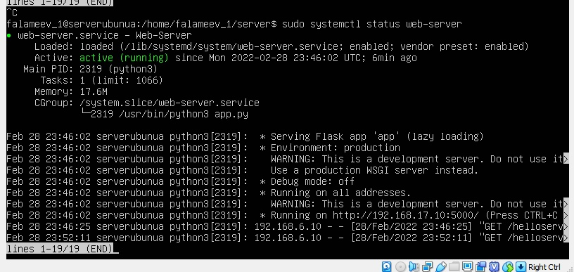
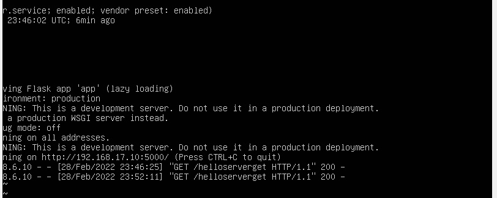
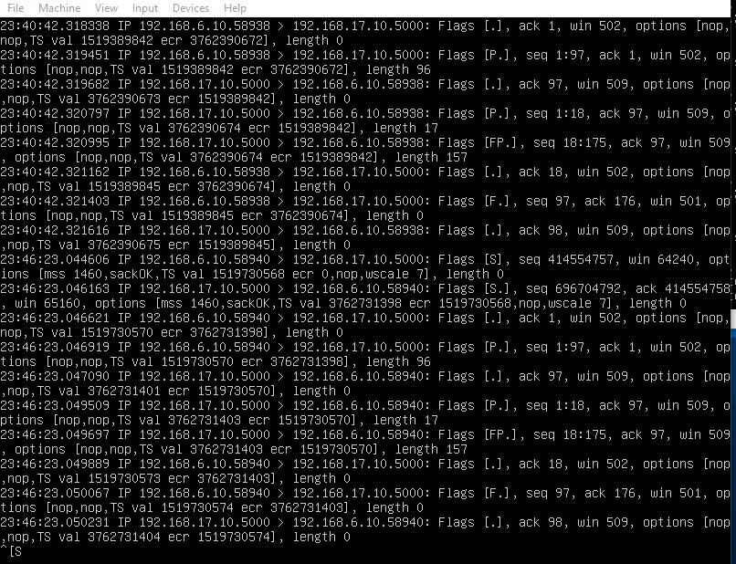
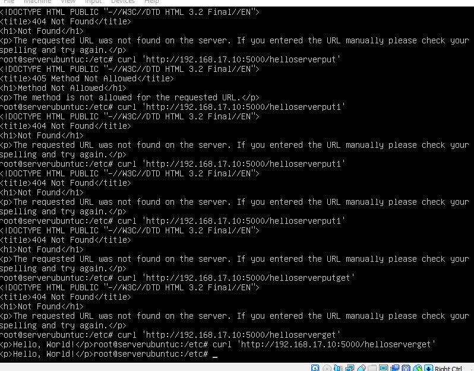

# Веб-сервер (Машина А)
На данной машине установлен и развернут http сервер на порту 5000:



Продолжение изображения:



# Веб-шлюз (Машина B)
Данная машина служит шлюзом для передачи данных из разных подситей.
Воспользуемся следующей командой, чтобы отобразить передчу данных через шлюз
```shell
sudo tcpdump -i enp0s8 tcp
```
Получим следующий результат: 



Исходя из данного результата мы видим, что через шлюз с адреса 192.168.6.10 на адрес 192.168.17.10:5000 приходит запрос.
И с адреса 192.168.17.10:5000 на 192.168.6.10 приходит ответ.

# Веб-клиент (Машина С)
В результате организации связи между вертуальными машинами мы должны полчить ответ на следующий запрос:
```shell
curl 'http://192.168.17.10:5000/helloserverget'
```
Тогда ответ будет:
```shell
<p>Hello, World!</p>
```

