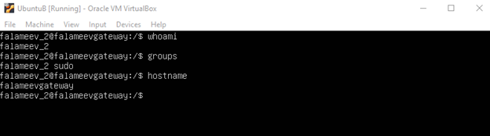

# Веб-сервер (Машина А)
Данные об Ubuntu A:
 


На данной машине установлен и развернут http сервер на порту 5000:


Конфигурация адаптеров:


# Веб-шлюз (Машина B)
Данные об Ubuntu B:
 


Данная машина служит шлюзом для передачи данных из разных подсетей.
Конфигурация адаптеров:


Обхор конфигурации перенаправления запросов в машине UbuntuB:


Проверим наличие 1 у параметра:


Воспользуемся следующей командой, чтобы отобразить передчу данных через шлюз
```shell
sudo tcpdump -i enp0s9 tcp
```
Получим следующий результат: 


Исходя из данного результата мы видим, что через шлюз с адреса 192.168.6.10 на адрес 192.168.17.10:5000 приходит запрос.
И с адреса 192.168.17.10:5000 на 192.168.6.10 приходит ответ.
При отправки запроса на порт 4000 запрос через шлюз не доходит до сервера:


# Веб-клиент (Машина С)
Данные об Ubuntu C:
 


Конфигурация адаптеров:


В результате организации связи между вертуальными машинами мы будем работать со списком следующего типа: (Имя:Рост). В ходе работы были реализованы запросы на отображение всего списка, отображение отдельного человека из списка с ростом, изменение роста конкретного человека через put запрос и добавление нового члена списка через post запрос.
Примеры запросов представлены sh.sh.


При перезагрузке все машины возвращаются в заданное состояние. Все файлы и конфигурации сохранены. Сервер автоматически запускается при перезагрузке.